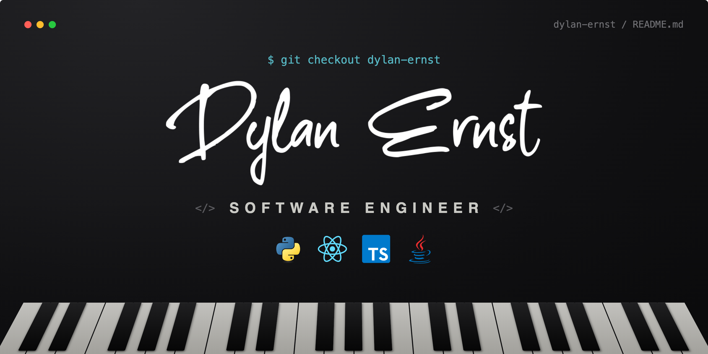

<div align="center">



</div>

```js
const dylan = {
  work: "Engineering at TRSTX",
  also: "Independent contract software engineer",
  offline: ["teaching piano", "jiu-jitsu"],
  loves: "writing code"
};
```

<div align="center">


<br>

<a href="https://github.com/pianodre/Clear-Cut-Background-Image-Removal">
  
</a>
<a href="https://github.com/pianodre/Web-Projects">
  
</a>

<a href="https://github.com/pianodre/resume">
  
</a>
<a href="https://github.com/pianodre/CPSC390-Artificial-Intelligence">
  
</a>

<br><br>


<br>


<br><br>

### Let's connect

[LinkedIn](https://linkedin.com/in/dylan-ernst-979ab1252) · [Email](mailto:dylanernstr@gmail.com) · [dylanernst.dev](https://dylanernst.dev) · [TRSTX](https://trstxcyber.com)

</div>
